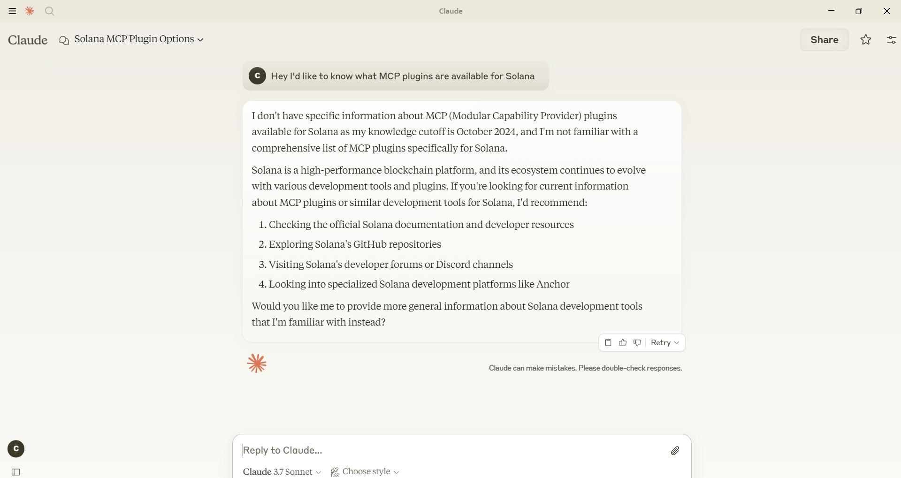
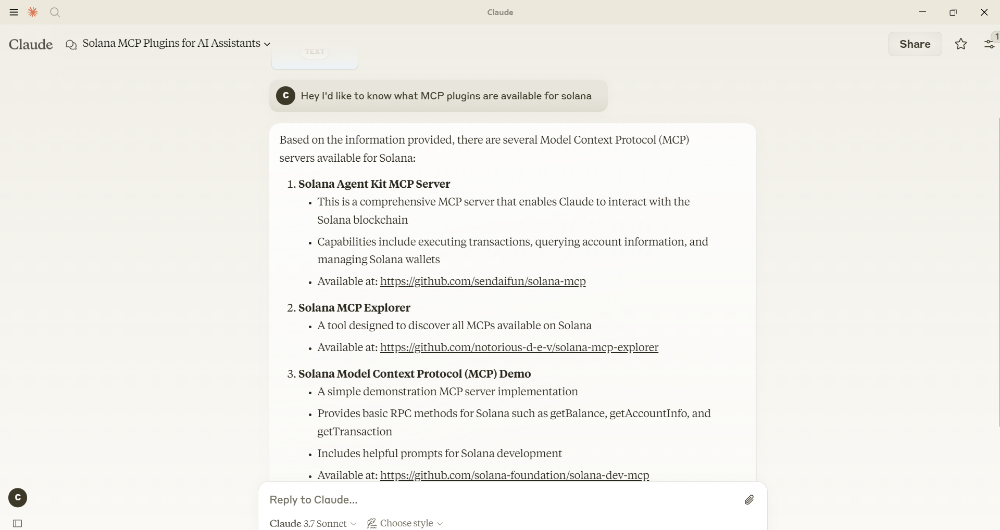

# solana-mcp-explorer
Explore all of the MCP Servers in the Solana ecosystem!

Before


After



Simply add this MCP Server to your MCP Host, and you can explore all of the MCP Servers in the Solana ecosystem.


## Installation Instructions

Below are instructions for integrating this MCP Server with your MCP Host. For example, Claude Desktop.

### Claude Desktop
Add the following to your Claude Desktop configuration file

```json
{
  "mcpServers": {
    "solana-mcp-explorer": {
      "command": "npx",
      "args": [
        "solana-mcp-explorer@latest"
      ]
    }
  }
}
```

## Adding Your MCP Server to the Explorer

We would love to have your MCP Server added to the Explorer!

To add your MCP Server to the Explorer, please edit the `src/servers.js` file with your server's information, and submit a PR.
